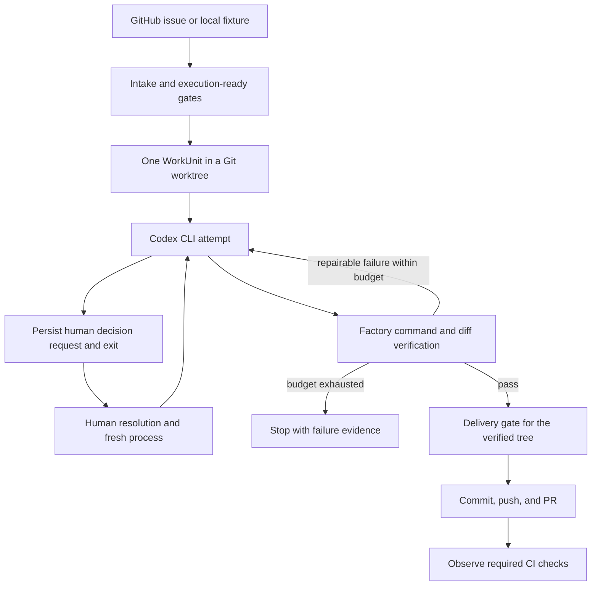
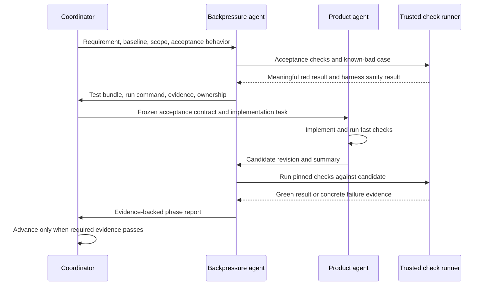

# Bootstrap plan: a factory that can build its next feature

Status: P0, P1, and P2 accepted. P3 and P4 passed all independent runnable checks, but required live proof is blocked. P5 implementation is starting. The user authorized continuation through P5. P6 remains planned. See the [P0 acceptance report](phase-reports/p0.md), [P1 acceptance report](phase-reports/p1.md), [P2 acceptance report](phase-reports/p2.md), [P3 local verification report](phase-reports/p3.md), and [P4 local verification report](phase-reports/p4.md).

Build one local CLI that takes one request, runs Codex in a Git worktree, independently verifies the result, and produces a PR. It must retain its state across process exits, pause for a human decision, and make a bounded repair attempt. Use this version to build subsequent factory features.

Every phase has two separate agents: a **backpressure agent** that builds and runs the acceptance checks, and a **product agent** that implements the capability. The checks must exist before product implementation starts. This is a development process requirement. It does not require multi-agent scheduling inside the bootstrap product.

## Basis and current state

This plan follows [Software Factory Kernel v0.2](<Software Factory Kernel — Conceptual Specification v0.2.md>), especially sections 2, 11–24, 34–45, 53, and 60–78. It also follows the [Semantic Supervision addendum](<Software Factory Spec Addendum — Semantic Supervision and Jev.md>), especially sections 3, 10, 19, and 25–26.

At planning time, the workspace contained only those two specifications. It had no application code, test harness, package manifest, or Git repository. P0 has since added the executable foundation and independent acceptance suite. Node, npm, Git, and GitHub CLI are available. P1 setup confirmed Codex CLI 0.157.1 with ChatGPT authentication and GitHub CLI authentication as `fdsprod`. A target GitHub repository is still needed for P3 and P5. The user selected Codex CLI as the first real worker for P1.

There are three deliberate scheduling decisions:

| Specification tension | Bootstrap decision | Reason |
|---|---|---|
| Section 53 includes repair in self-hosting, while roadmap M6 follows self-hosting | Move a bounded local repair loop before the self-hosting gate | The first useful version must recover from a failed implementation |
| JSON schemas and architecture tests appear in M7, but earlier sections require schema-first contracts and kernel boundaries | Add only the schemas and boundary checks used by each slice, starting in P0 | The bootstrap cannot depend on checks that arrive after it |
| Section 72 gives a larger maturity gate than the first self-hosted PR | Separate first useful self-hosting from permission to expand into advanced features | Start using the factory early, then collect reliability evidence |

These decisions refine roadmap order. The original specifications remain unchanged. Record them in a short bootstrap ADR during P0.

## The smallest representation

Keep one TypeScript project, one CLI composition root, one local runner, one configured repository per run, and one WorkUnit per WorkRequest. Put application code under `src/` and acceptance tests under `tests/spec/`. Use module boundaries for contracts, kernel, CLI, and adapters within this single package. Introduce each adapter only when its slice needs it.

The following is the complete bootstrap path. Each transition remains under kernel control.



Use the existing domain contracts in the specification. Implement only the portions needed by an accepted slice, with JSON schemas at process and persistence boundaries. Keep state and outcomes as discriminated unions. Keep WorkUnit execution state separate from delivery and CI state. A PR can exist while CI is pending or failed.

Persist consequential events and the current projection atomically in SQLite. Store command output, diffs, and other evidence on disk, outside the product worktree. Evidence refers to the exact candidate tree, verification contract, and attempt. The projection is a transactional view of durable history, not a second authority. These choices prevent contradictory status flags and prevent evidence for an old tree from approving a new tree.

The scope boundary is explicit.

| Include by first self-hosting | Defer until real use justifies it |
|---|---|
| Local `run`, `resume`, and basic status inspection | Daemon, dashboard, webhooks, distributed execution |
| One-unit graph and one active worker | Decomposition, multi-unit scheduling, parallel workers |
| Codex adapter with typed outcomes | Model routing, general agent framework, dynamic plugins |
| Commands, diff constraints, required evidence | Browser verification, broad review-routing framework |
| SQLite, local artifacts, restart recovery | Generic event-sourcing platform, telemetry service |
| GitHub issue, decision comments, PR, CI observation | Other trackers, automatic merge, deployment, remote CI repair |
| One initial attempt plus one local repair attempt by default | Plateau classification, autonomous replanning |
| Explicit human decision and configured authority | General policy language, precedent engine |
| Events useful for later evaluation | Jev, semantic supervision, learned memory |

## How the two agents work

For phase N, assign `BP-N` and `PRODUCT-N` to separate agent sessions. Give both the same requirement and public contract. The backpressure agent derives checks from the specification and observable behavior. It does not copy the product agent's implementation plan into assertions.

Use this sequence for every phase, including features built by the factory itself.



The role boundaries are narrow.

| Role | Owns | Cannot approve by assertion |
|---|---|---|
| `BP-N` | Acceptance scenarios, fixtures, failure injection, phase-specific architecture checks, independent rerun | Product correctness without executed evidence |
| `PRODUCT-N` | Product source, implementation-level tests, fixes | Changes to the frozen acceptance contract |
| Coordinator | Scope, assignment, test handoff, evidence completeness, integration | Missing required evidence |
| Human | Protected product decisions and merge/release authority | A test failure does not disappear because it is inconvenient |

Backpressure is a small test program, contract suite, restart harness, or recorded real-world exercise. Do not build a general backpressure platform before the product. Start with an external test harness and a phase report.

The common acceptance rules apply to every phase.

- [ ] `BP-N` maps every required behavior to a stable requirement ID and a runnable check or a named manual proof.
- [ ] The check fails on the baseline for the intended missing behavior. A syntax error, missing dependency, or broken fixture is not a meaningful red result.
- [ ] The harness has a passing sanity case. For a new invariant, at least one deliberate defect or known-bad fixture proves that the gate rejects it.
- [ ] The coordinator pins the checks, fixture inputs, configuration, and check command before handing off implementation.
- [ ] `PRODUCT-N` can read and run the checks. It cannot remove, skip, or relax them. Necessary contract changes return to `BP-N` and repeat the red/green cycle.
- [ ] `BP-N` reruns the checks against the exact candidate revision in a fresh test directory or process as appropriate.
- [ ] The final candidate passes the cumulative accepted scenarios, typecheck, build, and applicable architecture checks.
- [ ] The report records baseline and candidate revisions, requirement IDs, test-bundle digest, commands, exit codes, expected failures, logs, and artifact references.
- [ ] Missing, skipped, timed-out, or unavailable required checks block acceptance. Record infrastructure failures separately from product failures.

The user authorized continued implementation through P5. If a required live
exercise waits on an external destination or human answer, local implementation
of later phases can continue after all runnable checks for the prior candidate
pass independently. Record that candidate as an unaccepted baseline, then run
the next phase's committed red tests before implementation. This permits local
work to continue; it does not waive a live gate, accept a phase, or authorize
remote actions without a selected destination. Cumulative reports must retain
the missing live gate as blocked. P3 through P5 remain unaccepted until all
required inherited and phase-specific evidence passes.

During P0, the coordinator initializes Git and records the baseline. `BP-0` supplies the minimal runnable CLI stub and toolchain needed to exercise the agreed public interface. The stub returns a well-formed `not_implemented` result. Acceptance must fail because the required behavior is absent, not because the executable cannot start. This scaffold contains no kernel behavior. The product agent replaces the stub after the red result is recorded.

Keep the authoritative acceptance bundle outside the product agent's writable worktree. The runner uses its own pinned command rather than trusting a candidate-modified `npm test` script alone. Product tests remain useful additional evidence. If a phase changes the verifier itself, the last accepted verifier and the external harness still judge the candidate.

Git worktrees provide separate working copies. They are not a security boundary. P1 must establish and test the selected execution restrictions, including access to factory state and delivery credentials. This bootstrap targets a local operator and approved repositories, not hostile multi-tenant execution.

## Phase sequence

P0 is accepted. The remaining phases depend on the previous phase's acceptance report. Each is one end-to-end capability slice. The scope budget limits behavior and integration breadth, rather than setting an arbitrary line count.

| Phase | Product capability | Separate backpressure agent builds | Spec roadmap mapping |
|---|---|---|---|
| P0 | Deterministic request-to-verdict CLI | Black-box acceptance harness and transition checks | M0 plus minimum M7 checks |
| P1 | Real worktree, Codex, and command verification | Process/adapter contracts and fixture repository E2E | M1 |
| P2 | Durable restart and resume | Process-kill and side-effect reconciliation harness | M2 |
| P3 | Human decision, exit, and resume | Decision-authority and fresh-process scenarios | M3 |
| P4 | Bounded repair from verification evidence | Scripted failing-first attempt and retry-limit scenarios | Minimum M6 moved earlier |
| P5 | GitHub issue to PR and CI status | Delivery contract, duplicate-effect tests, live E2E | M4 |
| P6 | Factory implements its own next features | Independent feature tests and self-hosting evidence audit | M5 |

### P0 — Prove that agent completion cannot bypass verification

**Question:** Can a public CLI drive one request through the kernel and reject a false completion claim?

**Path:** CLI → fixture intake → one-unit graph → scripted worker → verifier → observable result.

**Scope budget:** One local request format, one WorkUnit, in-memory storage, scripted adapters, one pass path and one rejection path. No network or real LLM.

**BP-0 builds first:** The runnable stub, basic build/typecheck/test setup, initial requirement-to-scenario map, and a process-level scenario harness that asserts CLI results and emitted events. Add an exhaustive transition table, schema-boundary checks, and an import rule that prevents the kernel from importing adapters. Use a deliberately dishonest worker that reports completion while the verifier fails.

**PRODUCT-0 builds:** The smallest runnable contracts, kernel, CLI, and deterministic fakes. Add only schemas consumed by this path and the bootstrap ADR. The coordinator owns Git initialization. `BP-0` owns the acceptance setup and requirement map.

The exit gate requires these observations.

- [x] Valid input produces exactly one WorkUnit and reaches `VERIFIED` only after every required check passes.
- [x] A worker completion claim with failed verification cannot produce `VERIFIED` or delivery. Repairable failure may stop at `REPAIR_READY` until P4 supplies execution of repair.
- [x] Missing, duplicate, or unknown verification result IDs cannot substitute for required results. An empty verification contract is rejected for executable product work.
- [x] Direct `RUNNING → VERIFIED` and unresolved-decision bypasses are rejected.
- [x] Malformed input fails before worker invocation. Kernel-to-adapter import violations fail the architecture gate.

**Useful outcome:** A runnable executable specification that can judge the next implementation slice.

### P1 — Make a real edit and independently check it

**Question:** Can the factory control a real Codex process and prove behavior in its isolated working copy?

**Path:** CLI → fixture request → Git worktree → Codex CLI → real command verification → diff and evidence.

**Scope budget:** One configured Codex profile, one fixture feature, one target operating environment. Preserve deterministic scripted-worker tests for repeatability. No delivery or restart promise yet.

**BP-1 builds first:** A tiny fixture repository with an externally asserted behavior. Add a subprocess double that emits malformed output, exits unsuccessfully, hangs, and claims success without a correct edit. Add a live Codex smoke scenario with a deterministic behavioral assertion. Prove that worker changes to test scripts or protected checks cannot manufacture acceptance.

**PRODUCT-1 builds:** Git worktree creation, one agent CLI adapter, bounded process execution, command and diff verification, and local artifact storage. Stop the worker before verification. Bind results to a candidate tree and detect changes during verification. An exit code alone is not an `AgentOutcome` and an `AgentOutcome` is not a verification result.

Use Codex's documented non-interactive interface: `codex exec`, JSONL events with `--json`, and a final JSON-schema response with `--output-schema`. The adapter validates and translates that output into the factory protocol. Confirm actual flags and process behavior against the installed version during this phase. See [official non-interactive mode documentation](https://learn.chatgpt.com/docs/non-interactive-mode).

The exit gate requires these observations.

- [x] Codex makes the requested behavior change in the worktree. The original checkout remains unchanged.
- [x] The factory runs its own verifier after the worker ends and preserves the command, exit code, output, and candidate identity.
- [x] Wrong behavior, malformed outcomes, command errors, and timeouts block advancement.
- [x] Worker timeout and cancellation stop owned child processes in the selected Windows environment.
- [x] Protected verification files, factory state, and delivery authority remain outside the worker's allowed write/action scope. The negative fixture tests the actual restriction.
- [x] A mutation after verification invalidates delivery eligibility.

**Useful outcome:** A local assistant can make a verified change. An operator still handles restart and delivery until later phases pass.

### P2 — Resume durable work without guessing what happened

**Question:** Can a fresh process reconstruct a run and reconcile interrupted work from durable evidence?

**Path:** CLI run → SQLite transition → real worktree/worker/verifier → process termination → CLI resume → result.

**Scope budget:** One local runner per store, SQLite transactions, append-only events, current projection, local artifacts. No distributed leases or general workflow engine.

**BP-2 builds first:** A harness that launches and kills real factory processes at named fault points. Check every consequential persisted transition reached by the slice. Also interrupt between an external side effect and recording its result. Use counters and observed workspace identities to detect duplicated work.

**PRODUCT-2 builds:** Transactional state/event writes, restart loading, stable run/attempt/workspace IDs, and a local ownership lock. Record side-effect intent before action and reconcile on resume. If an attempt was interrupted, preserve its evidence and start a new attempt only after the old worker is confirmed stopped. Rerun incomplete verification against a stable tree. Keep completed valid verification when its tree and contract still match.

Set a finite total worker-start budget when creating the run, with a bootstrap default of five. Persist consumption before dispatch. Interrupted attempts and fresh starts after a human decision consume this budget. Resuming an idle process or rerunning a verifier does not. The count follows durable attempt history and cannot reset on restart. P4 adds a separate repair limit within this total budget. Exhaustion stops the run with evidence.

The exit gate requires these observations.

- [x] Kill/restart preserves run identity, prior attempts, decisions if present, and evidence references.
- [x] Completed work is not repeated. Interrupted work is explicitly reconciled or retried, never silently reported complete.
- [x] Event history and the current projection cannot disagree after an interrupted transaction.
- [x] An existing workspace is found after a crash between creation and result persistence.
- [x] A second runner cannot concurrently own the same store. Recovery does not leave two workers active.
- [x] Repeated process crashes cannot create an unbounded sequence of worker starts or reset the run's budget.
- [x] A missing or damaged required artifact blocks advancement with a useful diagnostic.

**Useful outcome:** The factory can run longer tasks without depending on the lifetime of its original process or agent conversation.

### P3 — Pause for a human and resume in a new session

**Question:** Can human authority survive process exit without being inferred from an agent claim?

**Path:** Worker decision outcome → durable request → GitHub decision comment → process exit → authorized resolution → fresh CLI resume → verification.

**Scope budget:** One decision at a time, one configured authorized resolver, one explicit response format tied to a decision ID. Use a fake gateway for deterministic tests and a real issue for the integration proof. General policy automation is deferred.

Until P5 supplies GitHub intake, the local normalized request fixture carries the configured repository and GitHub issue identity. The decision adapter can therefore publish to a real issue without pulling issue-intake work into this phase.

**BP-3 builds first:** Scenarios for a valid decision, unresolved decision, wrong decision ID, unauthorized responder, duplicate resolution, and conflicting resolution. The resume check starts a new process with a new worker context and no previous agent conversation.

**PRODUCT-3 builds:** Decision request/resolution schemas, durable waiting state, GitHub comment adapter, and inclusion of resolved decisions in the next ContextPackage. Reconcile comment publication after a crash. Awaiting a human ends the process normally with a distinguishable waiting status.

The exit gate requires these observations.

- [ ] A decision request persists before publication. The run enters `WAITING_FOR_DECISION` and has no live worker.
- [ ] Waiting is not failure. Resume without a valid resolution does not launch a worker or deliver a PR.
- [ ] Only a resolution from the configured authority for that decision unlocks work.
- [ ] Duplicate answers have no duplicate effect. Conflicting answers require explicit handling and cannot silently replace history.
- [ ] A fresh process supplies the recorded answer to a fresh worker and continues the same run.
- [ ] Crashing after publication does not create duplicate decision questions on resume.

**Useful outcome:** The factory can handle protected decisions during its own development.

### P4 — Repair one failed implementation

**Question:** Can a new attempt fix a measured failure while the verification contract stays fixed?

**Path:** Worker → failed verification → durable failure evidence → fresh repair worker → same verification → result.

**Scope budget:** One initial attempt plus one repair attempt by default. Configure the bound per run and retain it across restart. No semantic failure classifier, automatic graph rewrite, or remote CI repair.

**BP-4 builds first:** A scripted worker that makes a known incorrect first edit and corrects it only when given the actual failure evidence. Add an always-failing worker, a restart between attempts, and a decision continuation followed by repair. These scenarios must be deterministic and must not rely on persuading a live model to fail.

**PRODUCT-4 builds:** Structured verification failure, next-attempt context, repair scheduling, and the attempt budget. Preserve the objective, constraints, contract, existing changes, decisions, and prior evidence. Stop with a recorded failure when the configured budget is exhausted. Reserve `REPLAN_REQUIRED` for cases that actually require a changed plan.

The repair limit counts launches caused by failed verification. A human-decision continuation does not consume a repair allowance, but it still consumes P2's total worker-start budget. This permits a decision and one repair without permitting an endless restart loop.

The exit gate requires these observations.

- [ ] The first failed verification cannot deliver. Its exact failure reaches the next attempt.
- [ ] The second attempt fixes the behavior and passes the original pinned checks.
- [ ] Repeated failure stops at the budget. Restart cannot reset the budget or lose prior evidence.
- [ ] A repair cannot weaken required tests, edit the acceptance contract, or authorize its own protected decision.

**Useful outcome:** The factory can correct ordinary implementation mistakes while building later slices.

### P5 — Deliver a verified change from a GitHub issue

**Question:** Can the factory create one auditable PR for the verified tree and report CI for that PR's head?

**Path:** GitHub issue → normalized request → existing execution/repair/decision loop → delivery gate → commit/push/PR → CI observation.

**Scope budget:** One GitHub repository, one deterministic branch per run, one open PR per run, configured required CI checks. Manual resume/poll is sufficient. No automatic merge, deployment, or remote CI repair.

**BP-5 builds first:** GitHub adapter contract tests, recorded API fixtures, and crash tests around commit, push, PR creation, and response persistence. Add stale-tree and stale-CI fixtures. Run a real end-to-end scenario against the selected repository after deterministic tests pass.

**PRODUCT-5 builds:** Issue intake, delivery policy, factory-owned commit/push/PR actions, idempotent reconciliation, and CI observation. Persist branch, base revision, candidate tree, commit SHA, and PR identity. Look for an existing result before retrying an uncertain remote effect. If reconciliation cannot decide safely, stop with evidence instead of creating another PR.

The exit gate requires these observations.

- [ ] A real issue produces a real PR with the requested behavior, verification evidence, and traceability to the run.
- [ ] Failed, missing, stale, or invalidated local verification prevents commit/push/PR advancement.
- [ ] Empty diffs, forbidden changes, and unresolved decisions block delivery.
- [ ] Restart around delivery creates no duplicate commit sequence or PR and never requires the worker to push.
- [ ] CI is evaluated for the delivered head SHA and expected required checks. Missing or pending checks remain pending. Old-head success cannot approve a new head.
- [ ] Failed CI is recorded separately from local `VERIFIED` state. It does not produce overall success or automatic merge.

**Useful outcome:** The complete bootstrap pipeline can now build the factory's next feature.

### P6 — Use the factory to build its own next feature

**Question:** Can the accepted factory deliver useful changes to itself under independently authored checks?

**Path:** Factory issue → last accepted factory binary → Codex edits factory source → pinned external acceptance tests → PR → CI → human review.

**Scope budget:** Two small real feature runs. Keep the feature boundary observable at the CLI. Suggested first feature: `factory inspect <run-id> --json` with an externally specified output contract. Suggested second feature: `factory explain <run-id>` that identifies the current blocking gate and references the evidence or decision needed to proceed. Basic internal status inspection already exists; these add useful operator-facing behavior.

**BP-6 builds first:** Feature-specific CLI scenarios against the P5 binary, where the new behavior is absent. Add a deterministic self-hosting scenario that forces a human decision and a repair failure. Audit the real run artifacts separately from that synthetic exercise.

**PRODUCT-6 builds:** The two features through ordinary factory work requests. It receives the new acceptance tests and allowed source scope. It does not replace the running factory or the checks judging its own change.

The exit gate requires these observations.

- [ ] Two real issues produce useful factory-source changes and factory-created PRs with passing required checks.
- [ ] Each feature has independent red-on-baseline and green-on-candidate evidence.
- [ ] At least one real self-hosted run pauses for an explicitly defined human decision, exits, and resumes in a new process.
- [ ] The deterministic self-hosting scenario proves failed verification, bounded repair, and protection of the acceptance checks.
- [ ] No operator manually patches product source, run state, or verification results to complete a claimed successful run. Any such intervention is recorded and the run does not count as autonomous proof.
- [ ] Evidence connects issue, run, base revision, attempts, decision, candidate tree, verification, PR, and CI head SHA.
- [ ] A human reviews and merges accepted changes. Only then is the next factory version built and selected for subsequent runs.

**Useful outcome:** We can use the factory to build the rest of the factory. This is the first useful self-hosting milestone.

## Keep self-modification from changing its own judge

For a run that builds version N+1, execute version N from a stable installation outside the target worktree. Pin the verification bundle before launching the product worker. Run the candidate's build and tests as child processes. Do not reload the candidate's kernel, verifier, or configuration into the running version N process.

Changes to schemas, state transitions, gate policy, verifier code, or CI configuration receive new checks from the backpressure agent. The external acceptance harness remains the authority for that change. Promote the new checks and binary only after the current acceptance gate and human merge. This leaves a small trusted bootstrap base that the product agent cannot revise during its own attempt.

## Initial files and ownership

The following paths are planned additions, marked `[new]`. Create each adapter only when its phase needs it. The backpressure source lives in the repository, but the active acceptance bundle is copied from a pinned revision to a separate verifier workspace.

```tree
docs/
  bootstrap-plan.md [new] #! This plan
  adr/
    bootstrap-boundaries.md [new] #! P0 scope and trust decisions
tests/
  spec/
    requirements.md [new] #! Stable IDs and scenario mapping
    scenarios/ [new] #! BP-owned black-box acceptance tests
    fixtures/ [new] #! BP-owned repositories and scripted workers
    harness/ [new] #! BP-owned runner and fault injection
src/
  contracts/ [new] #! JSON schemas and corresponding TypeScript types
  kernel/ [new] #! State, attempts, decisions, and gates
  cli/ [new] #! Composition and operator commands
  adapters/
    git/ [new] #! P1
    agent-cli/ [new] #! P1 Codex implementation
    command-verification/ [new] #! P1
    local-artifacts/ [new] #! P1
    sqlite/ [new] #! P2
    github/ [new] #! P3 decisions, P5 intake/delivery/CI
package.json [new]
factory.config.json [new] #! Non-secret operator configuration
```

## Requirements that must stay visible

P0 turns these references into executable requirements. Existing example IDs from kernel section 63 retain their meaning. New `BOOT-*` IDs are local to this plan until recorded in the requirement map.

| Requirement | Source | First proof |
|---|---|---|
| `AGT-004`: Agent completion cannot directly mark a unit verified | Kernel sections 12, 63 | P0 transition and dishonest-worker scenarios |
| `VER-002`: The factory independently executes required verification | Kernel sections 24, 63 | P0 scripted gate, P1 real commands |
| `ARC-001`: Kernel cannot import adapters | Kernel sections 50, 63–64 | P0 import check, retained thereafter |
| `RUN-001`: Run survives termination after persisted transitions | Kernel sections 13, 63 | P2 process-kill matrix, expanded in P3–P5 |
| `DEC-003`: Waiting for authority is not failure | Kernel sections 19, 63 | P3 exit/restart scenario |
| `BOOT-001`: Required evidence matches the candidate and frozen contract | Kernel sections 25, 42, 45, plus bootstrap refinement | P1 mutation scenario, P5 delivery scenario |
| `BOOT-002`: Repair is bounded and preserves the work contract | Kernel sections 28–30, 53 | P4 fail/repair/exhaust scenarios |
| `BOOT-003`: Delivery and CI preserve revision identity | Kernel sections 31–32, 42–43, plus bootstrap refinement | P5 duplicate-effect and stale-CI scenarios |
| `BOOT-004`: The implementer cannot weaken its acceptance gate | User requirement plus kernel sections 60–64 | Every BP handoff, P6 self-modification scenario |
| `BOOT-005`: A model assessment cannot supply protected authority | Addendum sections 3, 11, 25 | No supervisor in bootstrap; authority tests required when added |

## After the first useful version

Continue using the same separate-agent process for every later phase. First collect ten successful real runs, two human-merged self-changes, and recorded restart, decision, repair, delivery, and boundary proofs. This adopts the larger maturity gate from kernel section 72 before advanced expansion.

The later sequence is a backlog, not a requirement to implement before self-hosting. Each row still has a separate backpressure assignment.

| Later phase | Product work | Separate backpressure agent's artifact |
|---|---|---|
| Adapter hardening | Replace one concrete adapter without changing semantics | Shared contract suite run against both adapters |
| WorkGraph | Multiple units and dependencies, initially serial | DAG scenarios proving dependencies and independent progress |
| Replanning and experiments | Explicit plan revision and assumption tests | Failed-assumption scenario retaining completed evidence |
| Parallel execution | Worker limits, ownership, isolated workspaces | Contention and crash tests proving no duplicate ownership |
| Broader review and evidence | New verification types and review findings | Known-defect fixtures proving findings lead to measured evidence or repair |
| Decision policy | Approved rules resolve eligible questions | Authority matrix tests proving protected decisions still pause |
| Semantic supervision, when enough run data exists | Start with shadow-only assessment and recorded versions | Zero-authority tests, outage tests, and labeled local evaluation data |
| Calibrated supervision | Bounded reversible interventions only after evaluation | Holdout evaluation, action-limit tests, and rollback proof |
| Knowledge and learning | Provenance, revocation, then controlled promotion | Invalid-claim lineage fixtures and tests against silent policy promotion |
| External orchestration or operator UI | Add only when local operation shows a need | Replay/contract tests or operator task E2E against existing kernel semantics |

Jev remains optional. A semantic assessment can request investigation or additional verification under policy. It cannot mark work verified, resolve protected human decisions, or replace the deterministic acceptance checks.

## P0 execution handoff — completed

P0 completed this handoff and passed its acceptance gate. P1 and P2 also passed their independent acceptance gates. P3 and P4 passed every runnable independent check, with live proof still blocked. P5 implementation is in progress.

- [x] Coordinator establishes the initial Git baseline and pins the P0 public CLI/fixture contract.
- [x] `BP-0` builds the runnable stub and toolchain, executable harness, requirement map, pass sanity case, and dishonest-worker rejection case.
- [x] `BP-0` records meaningful red evidence and hands over the frozen acceptance bundle.
- [x] `PRODUCT-0` implements the smallest CLI-to-verdict path.
- [x] `BP-0` independently reruns the candidate and records the phase result.
- [x] Coordinator accepts P0 only after all required checks pass.

P1 established Codex authentication, structured outcomes, and process termination in disposable fixtures. The P3 live exercise still needs a selected GitHub repository and authorized human resolver. The P5 live exercise also needs required CI checks and delivery policy. Local implementation can continue under the evidence policy above. Missing live inputs still block formal acceptance.
